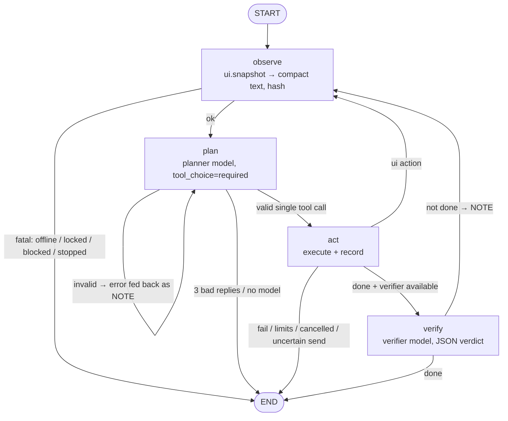

# The phone agent (LangGraph)

Code: `brain/src/nixin/agent/graph.py`, tools in `tools.py`, prompts in `prompts.py`, screen rendering in `screen.py`.

## Graph

State (`AgentState`): goal, hint, step/max_steps, deadline, history (bounded log), current screen + hash, stale-screen and repeat counters, pending tool call, note (feedback to the model), llm_errors, verify_rounds, outcome.

## Why one fresh prompt per step (not a growing chat)
Each planner call gets: short system prompt + `GOAL`, memory lines, the **last 8 steps as a one-line-each log**, an optional `NOTE` (validation error, "screen didn't change", verifier feedback) and the **current screen**. That keeps every call around 1.5–3k tokens no matter how long the task runs — essential with free-tier limits of ~8k tokens/minute per model — and the model always reasons over the *current* screen, never a stale one.

## Tools (planner)
`tap(id)`, `long_press(id)`, `type_text(text, id?, submit?)`, `scroll(direction, id?)`, `press(back|home|enter|recents)`, `open_app(name)`, `swipe(x1,y1,x2,y2)`, `tap_xy(x,y)`, `wait(seconds)`, `look(question)` (screenshot → vision model, only if enabled), `send_message(to, text, channel)`, `call_contact(to)`, `read_notifications(app?)`, `ask_user(question)`, `done(summary, answer?)`, `fail(reason)`.

Validation before anything reaches the phone (`check_tool`): known tool name, element id exists in the latest snapshot, element not disabled, no typing into password fields, coordinates inside the screen, `look` only when vision is enabled. Failures go back to the model as a NOTE instead of being executed. There is no shell, no raw intent, no package-name tool.

## Stop conditions
- `done` (then verified) or `fail`
- `max_agent_steps` (default 15) or `max_task_seconds` (180)
- same action on the same screen 3× → "stuck"
- screen unchanged after 2 UI actions → NOTE nudges a different approach
- 3 consecutive unusable model replies / 4 invalid actions
- kill switch, cancel ("ruk ja", Ctrl+Alt+K, dashboard Stop), phone offline/locked/blocked app
- an external action ends `uncertain` → stop, never resend

## Models
- **planner** (`gpt-oss-120b` first): chooses each action, `reasoning_effort=low` for speed.
- **verifier** (`qwen` first): after `done`, sees goal + action log + fresh screen and answers `{"done": bool, "reason": ""}`. If "not done" and budget remains, the reason becomes a NOTE and the loop continues (max 2 verify rounds). This is where "Verifier / backup" from the original idea lives — it checks outcomes instead of doubling the cost of every step.
- **vision** (optional): `look()` sends a screenshot with numbered boxes drawn over interactive elements (set-of-marks) so the answer can reference ids the planner can tap.

## Safety inside the loop
- Screen text is labelled untrusted; the system prompt forbids following instructions found in it. Even if the model is fooled, it can only emit the fixed tools, and the phone enforces blocklists/sensitive fields/confirmations itself.
- Messages and calls from the agent **always** require your confirmation (they're not deterministic).
- Tapping a control labelled Send/Pay/Delete/Call… triggers `policy.confirmation_required` on the phone; the agent asks you and retries once with confirmation.

## Classifier (before the agent)
One call to the fast model with high-level tools (`set_volume`, `open_app`, `send_message`, `set_alarm`, `search`, `read_notifications`, `remember`, `set_nickname`, `phone_task(goal)`, `reply(text)`, `ask(question)` …). It can return several tool calls in order ("torch on karo aur mummy ko bol main aa raha"). Only `phone_task` starts the agent.

## Observability
Every node emits events (`agent` → observe/plan/act/verify/end) to the dashboard timeline and console, and steps are stored in SQLite (`/api/tasks/{id}` shows the whole run). Model reasoning text is not stored — only the tool choice, arguments and results.
