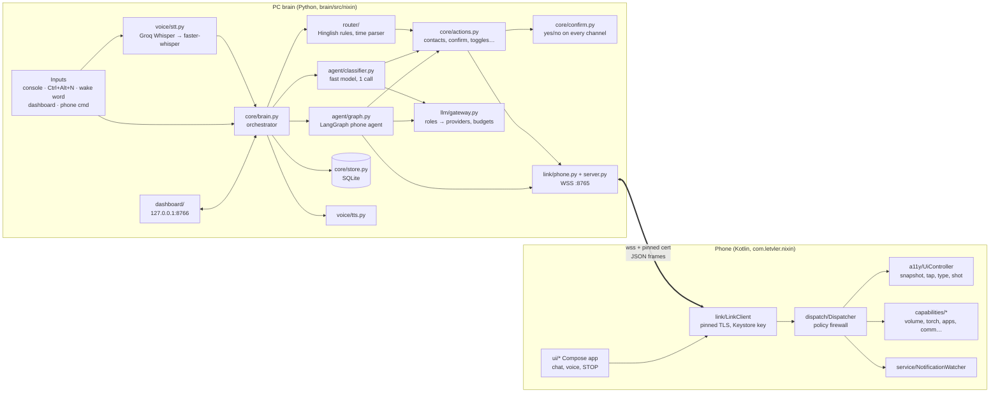
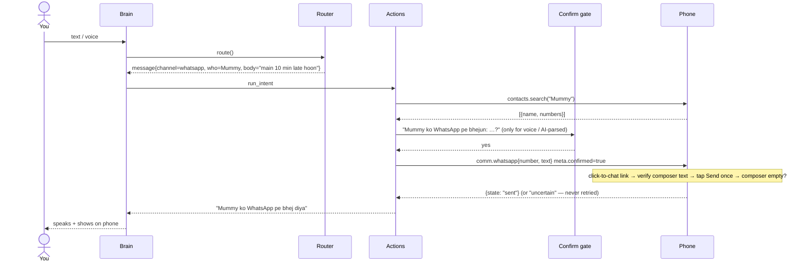
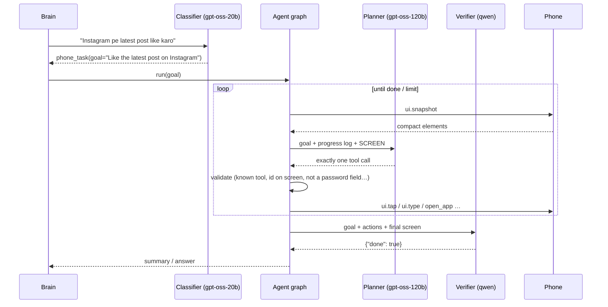

# Nixin architecture

**PC = brain, phone = eyes and hands.** The PC does speech, reasoning, memory and the dashboard; the phone executes and enforces safety. They talk over one authenticated, certificate-pinned WebSocket on your LAN (or Tailscale).

## Components



## Nixin 2.0: feature modules

`brain/src/nixin/features/` holds the 2.0 capabilities. Each is a small `Feature` that registers handlers for its
intent kinds into `Actions.handlers` (same signature as the built-in actions, so the router, the classifier and plugins
all reach them the same way) and may run background tasks:

| Module | Intent kinds | Background |
|---|---|---|
| `routines.py` (RoutineEngine) | routine_add, reminder, routine_run/list/toggle/delete | 15 s clock + the bus `device_event` stream |
| `skills.py` | skill_teach/save/cancel/run/list/delete | — (also used by the agent: replay known routes first, learn new ones) |
| `notifications.py` | notif_reply/summary/clear/open | live mirror: toasts + VIP announcements |
| `bridge.py` | inbox | phone `share` / `file` messages → `~/Nixin Inbox`; `push_bytes` → `file.push` |
| `pc.py` + `pc_control.py` | pc | — |
| `phone_extras.py` | find_phone, locate_phone, call_control, now_playing, usage, device_info, device_setting | — |
| `screen.py` | screen_read | — |
| `briefing.py` + `weather.py` | weather, briefing | — |
| `plugins.py` | plugin | loads `<data dir>/plugins/*.py` |

The Brain checks, in order: pending question → scene phrases (routines) → plugins → taught skills → router →
classifier → agent. Routine and plugin sub-commands run as `quiet` tasks (queued behind the current task, replies
collected instead of spoken). `Brain.announce()` / `notify()` / `post()` are the proactive outputs.

## The three execution lanes

| Lane | When | Cost | Example |
|---|---|---|---|
| **Router** (deterministic) | the command matches a known Hinglish/English pattern | 0 LLM calls, ~1 ms | `volume badha do`, `WhatsApp pe Rahul ko bol …`, `kal 6 baje alarm` |
| **Classifier** (fast LLM) | free-form but single-shot | 1 call (~1k tokens) | `thodi dheemi awaaz rakh do`, `bhai ko bol dena main aa raha` |
| **Agent** (LangGraph) | needs navigating app screens | 1 call per step + 1 verify | `Instagram pe latest post like karo` |

Why this order: free tiers give each model only a few thousand tokens per minute. Handling 80% of daily commands without a model keeps Nixin instant and leaves the budget for real agent work.

## Flow: `WhatsApp pe Mummy ko bol main 10 min late hoon`



## Flow: agent task



## Model roles (all configurable, all free tiers)

| Role | First choice | Fallbacks | Job |
|---|---|---|---|
| classifier | `groq:openai/gpt-oss-20b` | cerebras gpt-oss-120b, gemini flash-lite, openrouter :free | understand free-form commands, pick tools |
| planner | `groq:openai/gpt-oss-120b` | cerebras gpt-oss-120b, groq gpt-oss-20b, gemini flash, openrouter :free | drive the phone step by step |
| verifier | `groq:qwen/qwen3.8-27b` | groq qwen3-32b, gpt-oss-20b, gemini flash-lite | confirm "done" claims; backup capacity |
| vision | `groq:meta-llama/llama-4-scout-17b-16e-instruct` | gemini flash, openrouter qwen-vl :free | screenshots when the tree is not enough (opt-in) |

On startup the gateway calls each provider's `/models`; a candidate that doesn't exist (e.g. a preview model that was renamed) is skipped automatically. Every call is checked against a local per-model budget (requests/min, tokens/min, per day) seeded from SQLite so restarts don't reset it; Groq's `x-ratelimit-*` headers and `retry-after` tighten it further. Result: Nixin waits a few seconds or falls to the next candidate *before* getting a 429.

## Screen representation

The phone serializes the accessibility tree to compact elements (visible + meaningful only; clickable rows absorb their child labels; password text never included):

```
App: WhatsApp (com.whatsapp) · title "Rahul Sharma" · screen 1080x2400 · keyboard open
[1] button desc="Navigate up" @50,140
[2] text "Rahul Sharma" @410,140
[7] input hint="Message" (focused) @470,2250
[8] button desc="Send" @995,2250
```
A typical screen is 400–1,500 tokens instead of 20k+ for raw XML. Element ids are valid only for that snapshot; stale ids are rejected.

## Where state lives

| PC (`%LOCALAPPDATA%\Nixin`) | Phone |
|---|---|
| `nixin.db`: paired devices (public keys), tasks + agent steps, audit log, usage, memory (aliases, facts, conversation), dashboard setting overrides | SharedPreferences: paired PC (endpoints, pinned fingerprint), stop state, settings |
| `tls/`: self-signed cert + key | Android Keystore: device private key (non-exportable) |
| `identity.json`: pcId | memory only: chat, activity log, recent notifications |

Nothing is backed up to the cloud (`allowBackup=false`, backup rules exclude everything).

## Code map

| Path | What |
|---|---|
| `brain/src/nixin/app.py` | composition root, runtime settings |
| `brain/src/nixin/cli.py` | `nixin run/demo/sim/doctor/models/send/init/keys/devices` |
| `brain/src/nixin/core/` | brain, actions, confirm gate, memory, replies, store, events |
| `brain/src/nixin/router/` | normalization (Devanagari → Roman), rules, time parser |
| `brain/src/nixin/llm/` | OpenAI-compatible client, rate buckets, gateway |
| `brain/src/nixin/agent/` | LangGraph graph, tools, prompts, screen rendering, classifier |
| `brain/src/nixin/link/` | protocol registry, WSS server, PhoneLink |
| `brain/src/nixin/security/` | certificate + identity, pairing tokens, signature checks |
| `brain/src/nixin/voice/` | mic + VAD, STT, TTS, hotkeys, wake word |
| `brain/src/nixin/dashboard/` | FastAPI + static SPA |
| `brain/src/nixin/sim/` | Python phone client + stateful phone simulator |
| `android/app/src/main/java/com/letvler/nixin/` | `link/` `dispatch/` `a11y/` `capabilities/` `policy/` `service/` `voice/` `ui/` |
| `shared/protocol/methods.json` | the contract; both test suites assert parity with it |
