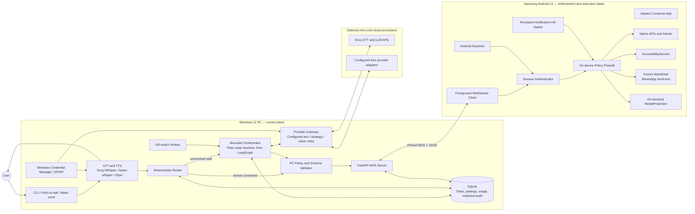
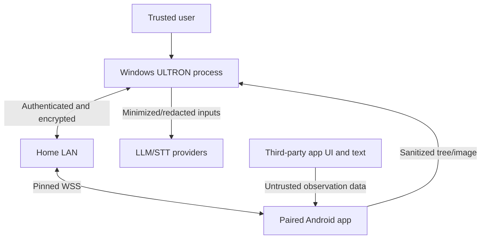
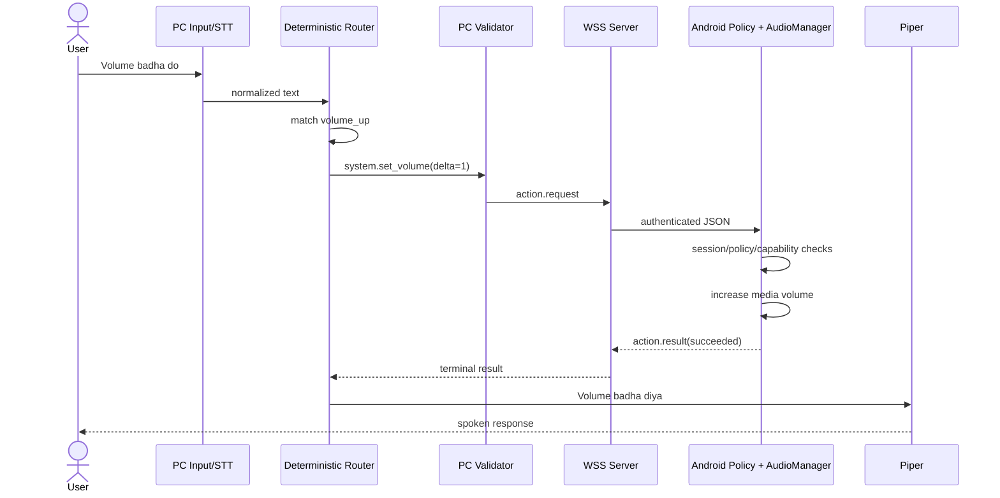
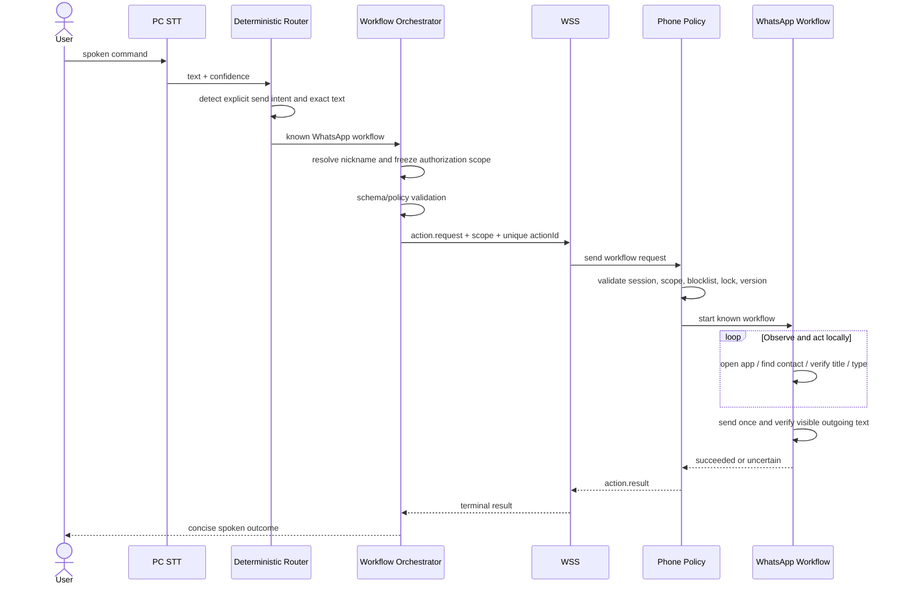

# ULTRON Architecture

## 1. Architecture summary

ULTRON uses a **local hub-and-endpoint architecture**:

- **Windows PC:** speech, routing, planning, persistence, provider access, and the WebSocket server.
- **Android phone:** authoritative policy enforcement, observation, and action execution.
- **Cloud APIs:** optional processors, never trusted executors.

The phone opens an outbound connection to the PC. No public server is required on the LAN.

## 2. Component diagram

## 3. Trust boundaries

- LAN peers are untrusted until pairing and session authentication complete.
- Model output is untrusted until it passes PC schema/policy checks and the phone policy firewall.
- Screen text is data, not instructions; it cannot alter policy or tool permissions.
- PC ingress freezes an authorization scope from the original command before any model call; external actions must match that scope.
- External message bodies are opaque local content references to models unless command-text export is independently enabled. The phone removes unrelated chat/history and sensitive text before tree export; image forwarding fails closed if redaction coverage cannot be established.
- Cloud audio, command text, UI tree, and image forwarding are four independent default-off grants. `cloud_assisted` alone grants none of them.
- The phone is the final runtime authority for package, signer, category, window/node identity, field, capability, and durable stop-state checks, but a fully compromised paired PC is outside the threat model and must be revoked.
- Windows session lock is a trust-boundary event: it suspends the connection, expires authorization scopes, and requires unlock plus a fresh phone session.

## 4. Execution lanes

### Lane A: native deterministic actions

Used for volume, torch, opening apps, global navigation, and alarms. The router produces a typed action without an LLM.

**Why:** lowest latency, no quota use, predictable testing, and smaller safety surface.

### Lane B: known phone-side workflows

Used for fragile but repeatable tasks such as sending a WhatsApp text. The phone owns recipient verification, field selection, send-once behavior, and app-version checks.

**Why:** a high-level workflow is safer than allowing a model to blindly tap a Send button. It also centralizes app-specific maintenance.

### Lane C: bounded agent actions

Used when the command needs screen-dependent navigation not covered by a known workflow. The graph observes, proposes one typed action, validates, executes, verifies, and repeats within strict limits.

**Why:** re-observation after each action handles changing UI better than a long plan created from stale state.

## 5. PC components

### 5.1 Input and speech

- Phase 1 input is a CLI so transport can be debugged independently.
- Phase 2 adds a global push-to-talk hotkey.
- Groq Whisper is optional cloud STT and requires the cloud-audio grant; faster-whisper is the local fallback.
- STT confidence is provider-supplied, derived from available provider metadata by a documented adapter, or `null`. Null or low confidence cannot authorize external effects and requires repeat/clarification.
- Piper is the default offline TTS.
- openWakeWord remains optional and off until an agreed measured false-accept/false-reject gate is met; it can never authorize external side effects.

**Why:** wake words and speech introduce ambiguity. They must not hide transport or executor defects during foundation work.

### 5.2 Deterministic router

- Normalizes English/Hinglish variants.
- Matches explicit command families and extracts bounded parameters.
- Emits typed actions or returns `unresolved`.
- Never guesses contacts or free-form UI actions.

### 5.3 Orchestrator

- Begins as a small explicit state machine.
- Moves to LangGraph when the multi-step agent phase begins.
- Maintains the task deadline, action count, last observation, no-progress count, and terminal status.
- Stores redacted checkpoints for inspection and dashboard use.

**Why LangGraph later:** its checkpoints and conditional edges are useful for agent recovery, but add unnecessary complexity before action contracts are stable.

### 5.4 Provider gateway

- Exposes one internal chat/tool/vision interface.
- Resolves symbolic roles to configured models by capability.
- Tracks request and token budgets.
- Applies timeouts, circuit breakers, and zero-cost eligibility.
- Never assumes that OpenAI-compatible APIs have identical tool or image behavior.
- Keeps every cloud role disabled until its startup capability probe passes; a configured model name is not readiness.
- Applies independent audio, command-text, UI-tree, and image-export policy before each request.

Default role resolution:

| Role | Preferred preview candidate | Used when |
|---|---|---|
| Navigator | `openai/gpt-oss-20b` | Default complex command and next-action proposal |
| Strategist | `openai/gpt-oss-120b` | Navigation recovery, repeated validation failure, or declared high complexity; never recipient ambiguity |
| Visual observer | `qwen/qwen3.8-27b` | UI tree is insufficient and phone-side image export is enabled |

All three IDs are preview candidates at planning time. Startup resolves each symbolic role from configuration, probes the required text/tool/vision capability, and disables or falls back from any unavailable candidate; no task assumes a specific catalog entry exists.

### 5.5 Transport server

FastAPI with Uvicorn hosts the authenticated WebSocket and leaves room for a future local dashboard and health endpoint.

**Why FastAPI over a bare WebSocket library:** typed lifecycle integration, diagnostics, and later local HTTP UI support outweigh the small overhead.

### 5.6 Persistence and secrets

SQLite stores:

- pairing metadata and public keys;
- task/checkpoint state;
- action-id dedupe facts mirrored from phone results;
- stable local contact enrollments (nickname, expected display name, verified E.164 or deterministic workflow identifier) and confirmation/privacy preferences;
- provider usage counters;
- redacted audit events.

Secrets are not stored in normal SQLite rows. Provider keys use Windows Credential Manager where possible; the PC identity key is protected with DPAPI. Audio and screenshots are not retained by default.

## 6. Android components

### 6.1 Compose app

Provides pairing QR scanning, connection status, permissions, four independent cloud data-class settings, contact enrollment, package/signer allowlists, tested app versions, logs, unpair/certificate-rotation guidance, and stop state. Clearing durable stopped state is available only through a physical action in this phone UI; it then requires a fresh session.

### 6.2 Foreground transport service

- Holds the WebSocket while enabled.
- Shows a persistent status/kill-switch notification.
- Sends heartbeats and reconnects with bounded exponential backoff.
- Reports permission and capability changes.
- Does not promise survival against every OEM policy; setup includes Samsung battery exemption.

### 6.3 Session authenticator

- Pins the PC certificate from the pairing QR.
- Keeps the phone private key in Android Keystore.
- Proves possession during every new connection.
- Rejects stale sequence numbers and expired sessions.

Pairing survives restarts; a trusted session does not.

### 6.4 On-device policy firewall

Validates every observation and action against:

- current authenticated session and Windows-unlocked signal;
- durable kill-switch state;
- strict schema, monotonic deadline, and expected data class;
- explicit package plus pinned signer allowlist (generic UI automation is default-deny);
- current foreground window package, target-node package, signer, and suspicious-transition check immediately before execution;
- immutable authorization scope for external side effects;
- package and category blocklists;
- sensitive-node flags;
- expected snapshot ID;
- capability and permission state;
- side-effect dedupe/status history.

No model or PC configuration may disable financial/credential blocking. Permission-controller, credential/biometric, IME/keyboard, overlay, and generic `com.android.systemui` windows are never observed or manipulated. Later notification reading uses a dedicated source-aware adapter that filters OTP-like content.

### 6.5 Capability adapters

- Native adapters wrap Android APIs and intents.
- Accessibility adapter performs global actions, semantic element activation, text input, and bounded scrolling.
- WhatsApp workflow provides the only MVP path to its Send action. It owns all internal navigation, checks the official package signer/supported version, resolves a manually enrolled stable contact identifier rather than title alone, and emits before/after evidence; visible local outgoing state means `send_accepted`, not delivered.
- Projection adapter exports a compressed frame only after Android consent, outside blocked contexts, and while the phone-side image-export setting is enabled. Cloud forwarding additionally requires PC image consent and proven redaction coverage; uncertainty fails closed.

### 6.6 Compact screen serializer

The serializer emits useful visible nodes only: role, short text/description, state, bounds, action flags, and a snapshot-scoped ID. It excludes invisible layout nodes, duplicate text, long content, and sensitive values.

**Why:** smaller observations reduce latency, quota use, accidental data exposure, and prompt-injection surface.

## 7. Simple command data flow

Example: `Volume badha do`.

No LLM is called. If the phone is disconnected or permission is unavailable, the command fails with a specific reason.

## 8. Multi-step command data flow

Example: `WhatsApp pe Rahul ko bol main 10 min late hoon`.

The standard WhatsApp command remains available in local-only mode and does not require an LLM. Its ordinary scope contains only `workflow.whatsapp.send_text`; the phone workflow owns opening, search, navigation, typing, and Send. A broader agent may invoke the same high-level workflow only when the immutable ingress scope authorizes the enrolled contact and exact message. In trusted mode the exact typed/push-to-talk send command is authorization; a user preference may require an additional confirmation. Calls, share, or delete always require confirmation if later implemented, and finance remains blocked. If identity, content, or STT confidence is ambiguous, the task pauses. `succeeded` means local `send_accepted`, never delivery, and an uncertain send is never retried.

## 9. Observation and verification strategy

Verification escalates from cheapest to most expensive:

1. Native API return and state query.
2. Accessibility event and compact tree change.
3. Expected package/title/element/postcondition.
4. On-demand screenshot and vision model, only when enabled.
5. `uncertain` terminal result if evidence remains insufficient.

The verifier does not execute actions; it only classifies evidence as `success`, `failure`, or `uncertain`.

## 10. Connection and lifecycle

1. PC starts, selects a private IPv4 interface, loads its identity, and opens WSS.
2. Phone connects using its pinned endpoint or mDNS discovery.
3. Both negotiate protocol version and phone capabilities.
4. Phone proves possession of its paired key; PC issues an ephemeral session.
5. Heartbeats run every 15 seconds; 45 seconds without a valid heartbeat closes the session.
6. Disconnect cancels volatile queued work. In-flight external effects become `uncertain` until read-only status reconciliation returns the durable phone state.
7. Reconnection creates a fresh trusted session and never replays an old request. The PC may issue `action.status.query` with the original `actionId`; the phone returns current/terminal cached state without executing anything.
8. Kill switch durably sets phone stopped state, clears queues, and ends the session. Only physical phone UI can clear it; resume opens a fresh session and cannot replay actions.
9. Windows lock suspends the session and expires scopes; unlock uses the same fresh-session rule.
10. Unpair revokes the phone/PC relationship. Certificate rotation uses authenticated rotation when valid or full QR re-pair otherwise.

## 11. Deployment topology

### Initial LAN deployment

- PC listens on a configurable port, default `8765`.
- Windows Firewall permits inbound TCP only on Private networks.
- QR pairing carries the reachable LAN address and certificate fingerprint.
- No port forwarding, Render service, or public tunnel is used.

### Later remote access

Tailscale is preferred because it provides device identity and encrypted private networking without exposing the WSS endpoint publicly. Cloudflare Tunnel remains an alternative only after its additional public-edge trust and authentication design is reviewed.

## 12. ADB power mode

ADB is a separate optional executor, not an extension of normal model tools.

- User explicitly enables wireless debugging and pairs the PC.
- A visible PC/phone indicator remains active.
- Only named command templates are exposed.
- Package install, screen recording, and selected settings actions have individual policy rules.
- Arbitrary shell text is impossible.
- Disabling Power Mode stops its executor and clears pending work.

## 13. Alternatives considered

| Decision | Chosen | Alternative | Why not initially |
|---|---|---|---|
| Runtime location | PC brain + phone executor | Full phone-only agent | Phone resources, background limits, and local model constraints |
| Transport | Phone-initiated WSS | HTTP polling | Higher latency and poorer event delivery |
| Server | FastAPI | Bare `websockets` | FastAPI better supports diagnostics/dashboard with little extra cost |
| Format | Versioned JSON | Protobuf | JSON is easier to inspect during learning; schema and size limits offset looseness |
| Agent | LangGraph after foundation | LangGraph from day one | Premature complexity before tools are reliable |
| Simple routing | Deterministic patterns | LLM classifier for every command | Adds latency, quota use, and nondeterminism |
| App automation | Semantic IDs + known workflows | Raw coordinates | Coordinates fail across layouts and can cause harmful taps |
| Remote access | Tailscale later | Render relay | No always-on hosting, lower exposure, still zero-cost for personal use |
| TTS | Piper | edge-tts | Piper is offline and avoids dependence on an unofficial/online service |
| Confirmation | Exact typed/push-to-talk send command in trusted session; optional extra per-action confirmation preference | Mandatory prompt for every ordinary send | Preserves the chosen default while allowing stricter preference; calls/share/delete always confirm if added, finance stays blocked, and wake word never authorizes side effects |

## 14. Architectural invariants

- No unauthenticated message reaches an executor.
- No LLM output bypasses strict JSON Schema validation, including format checks; application code inserts documented defaults before validation because schema defaults do not mutate instances.
- No generic UI observation/action occurs outside an explicit package plus signer allowlist, and no blocked package, sensitive field, permission controller, credential/biometric UI, IME, overlay, or generic System UI is observed or manipulated.
- No external side effect is automatically retried after uncertainty; reconnect uses read-only status reconciliation by original `actionId`.
- No external-side-effect authorization originates from unattended wake-word input.
- No paid or startup-unprobed provider role is selected.
- No cloud audio, command text, UI tree, or image is sent without its matching independent consent. No image leaves the phone without phone export consent, and uncertain redaction prevents cloud forwarding.
- No task runs beyond its action/time/budget limits.
- No stopped phone or locked Windows session accepts an action; resume is local-only and creates a fresh session.
- No arbitrary ADB shell command exists in the agent tool surface.