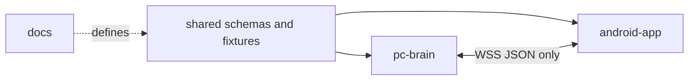

# ULTRON Repository Structure

ULTRON lives in `/ultron` inside the existing repository. `/ultron/docs` is the canonical planning source; files outside `/ultron` belong to the legacy project and are not modified by ULTRON work. Paths below are relative to `/ultron` unless they begin with `/ultron`.

## 1. Monorepo layout

```text
ultron/
├── pc-brain/
│   ├── pyproject.toml
│   ├── uv.lock
│   ├── config.example.toml
│   ├── src/
│   │   └── ultron_pc/
│   │       ├── __main__.py
│   │       ├── app.py
│   │       ├── config.py
│   │       ├── cli/
│   │       ├── input/
│   │       ├── speech/
│   │       ├── router/
│   │       ├── agent/
│   │       ├── providers/
│   │       ├── transport/
│   │       ├── security/
│   │       ├── policy/
│   │       ├── persistence/
│   │       ├── memory/
│   │       ├── tts/
│   │       ├── adb/
│   │       └── dashboard/
│   └── tests/
├── android-app/
│   ├── settings.gradle.kts
│   ├── build.gradle.kts
│   ├── gradle.properties
│   ├── gradlew
│   ├── gradlew.bat
│   ├── gradle/
│   └── app/
│       ├── build.gradle.kts
│       ├── proguard-rules.pro
│       └── src/
│           ├── main/
│           │   ├── AndroidManifest.xml
│           │   ├── java/com/ultron/app/
│           │   │   ├── UltronApplication.kt
│           │   │   ├── core/
│           │   │   ├── ui/
│           │   │   ├── transport/
│           │   │   ├── security/
│           │   │   ├── policy/
│           │   │   ├── service/
│           │   │   ├── accessibility/
│           │   │   ├── capabilities/
│           │   │   ├── workflows/
│           │   │   ├── projection/
│           │   │   ├── persistence/
│           │   │   └── audit/
│           │   └── res/
│           ├── test/
│           └── androidTest/
├── shared/
│   ├── protocol/
│   │   ├── schemas/
│   │   ├── examples/
│   │   └── test-vectors/
│   ├── fixtures/
│   │   ├── ui-trees/
│   │   ├── intents/
│   │   └── policies/
│   └── agent/
│       ├── schemas/
│       └── prompts/
├── docs/
│   ├── PRD.md
│   ├── ARCHITECTURE.md
│   ├── PROTOCOL.md
│   ├── AGENT_DESIGN.md
│   ├── REPO_STRUCTURE.md
│   ├── TASKS.md
│   ├── RISKS.md
│   └── SETUP.md
├── scripts/
│   ├── bootstrap-windows.ps1
│   ├── check-protocol.ps1
│   ├── run-pc.ps1
│   └── run-android-tests.ps1
├── .editorconfig
├── .gitignore
└── README.md
```

Only the eight files in `/ultron/docs` exist during planning. Source files are created phase by phase.

## 2. ULTRON root responsibilities

| Path | Purpose |
|---|---|
| `/ultron/pc-brain` | Windows Python application: voice, routing, graph, providers, WSS, persistence |
| `/ultron/android-app` | Kotlin Android app: pairing, policy, foreground service, observation, execution |
| `/ultron/shared` | Language-neutral protocol schemas, golden examples, fixtures, and model contracts |
| `/ultron/docs` | Product and engineering plan |
| `/ultron/scripts` | Windows-first development commands; no hidden production logic |
| `.editorconfig` | Shared whitespace/encoding rules |
| `.gitignore` | Excludes secrets, databases, recordings, screenshots, builds, and IDE state |
| `README.md` | Short developer entry point linking to `docs/SETUP.md` |

## 3. PC brain

### Root files

| File | Purpose |
|---|---|
| `pyproject.toml` | Python version, dependencies, test/lint/type-check configuration, CLI entry point |
| `uv.lock` | Reproducible Python dependency lock |
| `config.example.toml` | Non-secret configuration example; never contains real keys |

### Application packages

| Package | Purpose |
|---|---|
| `__main__.py` | Starts the documented CLI entry point |
| `app.py` | Application composition and lifecycle only |
| `config.py` | Typed configuration loading and validation |
| `cli/` | Pairing QR, typed commands, status, logs, and stop/resume commands |
| `input/` | Push-to-talk hotkey, microphone capture, and later wake-word events |
| `speech/` | STT interfaces, Groq Whisper adapter, faster-whisper adapter, confidence metadata |
| `router/` | Deterministic Hinglish/English normalization, pattern matching, entity extraction |
| `agent/` | LangGraph state, nodes, edges, prompts, tool schemas, stopping logic |
| `providers/` | Capability registry, Groq/OpenRouter/Cloudflare/Cerebras adapters, budgets, circuit breakers |
| `transport/` | FastAPI app, WebSocket connection registry, protocol dispatch, health endpoint |
| `security/` | PC identity, TLS certificate, DPAPI/keyring integration, challenge creation |
| `policy/` | PC-side risk classes, explicit-side-effect checks, app/action allowlists |
| `persistence/` | SQLite schema, repositories, migrations, retention and redaction |
| `memory/` | Contact nicknames, app aliases, preferences; no conversational transcript dumping |
| `tts/` | Piper process/voice adapter and output queue |
| `adb/` | Disabled-by-default allowlisted Power Mode executor |
| `dashboard/` | Later local-only dashboard; absent from initial runtime path |

### PC tests

```text
pc-brain/tests/
├── unit/
│   ├── router/
│   ├── policy/
│   ├── agent/
│   ├── providers/
│   └── persistence/
├── contract/
│   ├── test_protocol_examples.py
│   └── test_android_fixtures.py
├── integration/
│   ├── test_fake_phone.py
│   └── test_fake_provider.py
└── security/
    ├── test_replay.py
    ├── test_prompt_injection.py
    └── test_redaction.py
```

## 4. Android app

### Core packages

| Package | Purpose |
|---|---|
| `core/model/` | Internal typed values and result states |
| `core/protocol/` | Strict JSON serialization and shared schema compatibility |
| `core/config/` | Endpoint, policy, and privacy settings |
| `ui/` | Compose screens for pairing, status, permissions, apps, logs, and privacy |
| `transport/` | Pinned WSS client, heartbeat, reconnect, ordering, message dispatch |
| `security/` | Android Keystore key, pairing/session proof, certificate pinning, signer verification, revocation |
| `policy/` | Final package/signer/category/window/overlay/sensitive-field/action enforcement |
| `service/` | Foreground connection service and persistent kill-switch notification |
| `accessibility/` | Service lifecycle, compact tree serializer, semantic UI actions, events |
| `capabilities/native/` | Volume, torch, app launch, alarms, and global actions |
| `workflows/whatsapp/` | Version-aware one-to-one send-text state machine |
| `projection/` | MediaProjection consent, capture, resize, redaction, stop lifecycle |
| `persistence/` | Pairing metadata, settings, durable action-result dedupe cache |
| `audit/` | Redacted local action events and export |

### Android tests

```text
android-app/app/src/test/
├── protocol/
├── policy/
├── serializer/
└── workflows/

android-app/app/src/androidTest/
├── pairing/
├── foreground/
├── accessibility/
├── nativeactions/
└── whatsapp/
```

- JVM tests cover pure parsing, policy, and workflow state transitions.
- Instrumented tests cover Android APIs and service lifecycle.
- Manual device scripts remain necessary for real WhatsApp and Samsung background behavior.

## 5. Shared contracts

### Protocol schemas

`/ultron/shared/protocol/schemas` is the source of truth for envelopes, handshake messages, authorization scopes, actions, observations, results, and errors. Python and Kotlin must validate the same fixtures.

Recommended files:

```text
shared/protocol/schemas/
├── envelope.schema.json
├── pairing.schema.json
├── session.schema.json
├── capabilities.schema.json
├── authorization.schema.json
├── action.schema.json
├── observation.schema.json
├── result.schema.json
└── error.schema.json

shared/agent/schemas/
├── agent-action.schema.json
├── agent-decision.schema.json
└── visual-verdict.schema.json
```

The agent schemas define model-facing output. The PC mapping layer converts them to protocol actions; the Android app never consumes model-facing schemas.

### Examples and test vectors

- `examples/` contains valid messages copied from `PROTOCOL.md`.
- `test-vectors/` contains invalid signatures, expired tokens, replayed sequences, stale snapshots, oversize payloads, and unknown fields.
- Neither Python nor Kotlin keeps a separately edited duplicate schema.

### Fixtures

- `ui-trees/`: sanitized fake Android/WhatsApp observations.
- `intents/`: Hinglish and English command corpus with expected routes/entities.
- `policies/`: blocked package, sensitive-field, authorization-scope, and kill-switch cases.
- `agent/prompts/`: versioned prompt templates only; no API keys or captured user data.

## 6. Dependency boundaries



Rules:

- PC and Android share data contracts, not runtime code.
- Provider SDK types do not leak into agent state or protocol types.
- Accessibility node objects do not leave the Android adapter; only sanitized models do.
- Agent modules do not call Android actions directly; they use the transport/action interface.
- Phone workflow code does not depend on model-provider behavior.
- ADB remains outside the normal Android WebSocket executor.

## 7. Configuration and generated data

### Committed

- example configuration;
- JSON schemas and synthetic fixtures;
- prompt templates;
- database migrations;
- deterministic test command corpus.

### Never committed

- `.env` or API keys;
- PC private identity key;
- pairing tokens/device keys;
- SQLite runtime database;
- raw audio, screenshots, or UI dumps;
- APK signing secrets;
- real contact names/numbers or message logs;
- Android Studio local SDK paths.

## 8. Naming conventions

- Python modules and model-facing fields use `snake_case`.
- Kotlin types use `PascalCase`; members use `camelCase`.
- All WebSocket envelope and payload fields use the camelCase names defined in `PROTOCOL.md`; adapters perform explicit boundary conversion.
- Protocol message types and action names use lowercase dotted names such as `action.request` and `system.set_volume`.
- IDs are UUIDv4 strings with semantic protocol field names (`taskId`, `actionId`, `snapshotId`).
- Tests describe behavior, not implementation details.

## 9. Build boundaries

- `pc-brain` builds and tests independently on Windows without Android Studio running.
- `android-app` builds and runs unit tests without Groq keys.
- Contract tests validate `/ultron/shared` from both sides.
- Cloud provider tests use fakes by default; live tests require an explicit environment marker.
- No phase requires a deployed server.